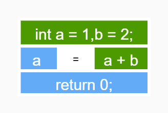
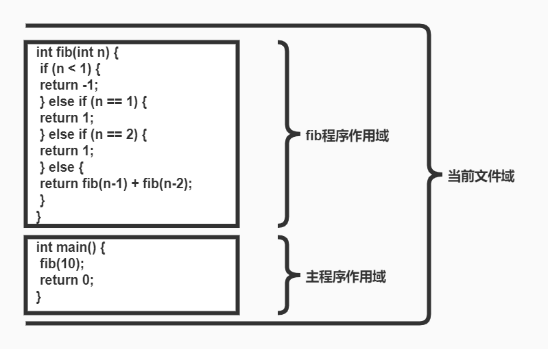

# 抽象

我们所拥有操控的能力全部来源于抽象。抽象是老师们很少提及，但是一直这么做的一种行为。事实上我们每个人每个时刻都在这么做。比如我们比较班级的时候，没有一个具体事物是班级在现实世界的映射。但是我们都会理解这个概念。同样的，我们的程序也是如此。

~~~cpp
int main() {
    int a = 1, b = 2;
    a = a + b;
    return 0;
}
~~~

翻译为中文：

~~~cpp
主程序：
    定义两个是 int 类型的变量：a，b 。并初始化为1和2
    让 a 变量的值改变为 a 和 b 相加的结果
~~~

这里我们看到了一些事情：

1. a和b的类型是被确定的（int 类型）
2. a和b是可以相加的
3. 对a操作的表达式中是可以有a的

我们先无视类型，因为我们暂时关注点在这个利用变量也就是抽象这件事情上。我们都知道数学上的等式，但是这里显然不是等式，而是赋值语句。但是这个赋值语句表达了什么呢？

计算机是有状态的，这一刻的状态和下一刻不完全一致。c++代码也是如此。这里我特别用了两种颜色区别前后两种状态。以这个赋值语句为分割，把`a`的值分为了两个状态：值1和值3。

~~~cpp
a = a + b;
// 这句话的意思是
当前 a + b 的值存在 a 变量的空间内
~~~

这里就体现出了，我们所谓的抽象。我们把一个能存储值的空间命名为`a`或者`b`。我们没有在意计算机存储这个值得地方在哪里（内存，寄存器，硬盘，...）但是我们具有了使用这个空间的和这个空间在书写处所具有状态的权力。把这种权力表现为对这个变量的控制。

这里带来了一个问题：这个权力的范围。究竟我们对某个变量拥有的权力究竟在那个范围内有效，哪个范围内无效呢？

## 权力的范围

如果定义了一个变量，这个变量是无约束的，任何人在任何位置都有对他的操作的权力的话，那么一定是一场灾难。

> 不加约束的自由，最终一定会成为强者对弱者的剥削 ——罗翔

如果真的发生这件事情了的话，那么我们的计算机世界一定有一个学课是专门讲述如何让其他人不能发现你所定义变量的名称。通过这种手段来达到不能改变你程序的目的，但这是不可能的，因为我们所常用的字符就那些，在一个大型软件系统中想要同时避免变量的冲突，还要防止别人的恶意篡改，那么就只能发明一套字符体系了。那所有计算机人的必修课就会多一门“符号学”。但是没有，因为编程语言的实现者设计了一个非常巧妙的体系：**词法作用域**

首先看一个图感受一下：

为什么在主程序内调用`fib(n)`？因为`int fib(int n)`的定义在当前文件夹，所以在这个文件夹内可见（后面会提到如何不可见）。

为什么`fib(n)`方法能被自己调用？这都得感谢 Edsger Wybe Dijkstra 先生。是他老人把递归这个特性加入到计算机里面的。而站在实现这个功能的角度上，显然是fib方法内部能看到自己。

看到了这个域的存在，我们的程序就清晰了。一个方法内部定义的变量在外部是不可见到的。

虽然不可见，但是我们看到了主程序和fib程序域的交融过程`fib(10);`，这个参数就是两个域交互的口，当然返回值也是。还记的我们前面提到主方法`return 0`的作用吗?这个返回的值是在调用域内可见的，也就是可以把这个`int`类型返回值赋值给`int`定义的变量。因为是同等变量。（在不远处，我们会了解如何进一步知晓变量的类型和类型之间的转换）

注意到最顶层的域被描述为当前文件，但是别的文件就不可以用了吗？还有为啥这个文件的执行都是从主程序`main`方法开始的呢？

首先，c++文件之间是可以联用的，其次，main方法是一种约定的入口。所以千万注意main方法的书写，不要重复书写。

## 跨越文件的约束力

~~~cpp
// fib_body.cpp
    if (n < 1) {
        return -1;
    } else if (n == 1) {
        return 1;
    } else if (n == 2) {
        return 1;
    } else {
        return fib(n-1) + fib(n-2);
    }

// main.cpp
int main() {
    fib(n);
    return 0;
}

// fib.cpp
int fib(int n){
# include "fib_body.pp"
}
# include "main.cpp"
~~~

编译一下`g++ fib.cpp -o fib`。发现没有任何错误。可以在我的fib文件夹下查看这几个代码。

两个问题：

1. 都不是一个文件，为什么主程序可以使用另一个文件的方法
2. 一个方法的内部的一些操作为什么可以在另一个文件内部实现

可以看到，我只是简单的把原来的那个例子简单的拆开成三个文件。然后再对应的地方用`#include "<file name>"`代替。（`<file name>`）就是对应拆除出去的部分所在文件的文件名。

这是因为计算机想要执行我们的程序需要一道翻译工序:代码文件->可执行文件

这里这个`#include`就标志着，再翻译之前的一步操作：整合文件。

把对应`<file name>`的文件内容，完全复制粘贴过去。所以所谓的文件域其实是再编译器处理整合之后的文件域，而不是我们所看到的文件的文件域。

所以我没有在示例程序或者开始引入的时候用下面的传统代码：

~~~cpp
#include <iostream>
using namespace std;
int main(){
    cout << "Hello, world" << endl;
    return 0; // 可以不要， main函数默认补上
}
~~~

因为这里涉及到了：

- include <>
- namespace
- cout, endl
- return

这些东西，这个实例程序会形成不好的思维惯性。前三者并不是c++的代码一定需要的内容，最后一个其实也是一种机制（在上一节Q&A）环节提到了。

## 好看的例子

~~~cpp
// fib.h
#ifndef FIB_H
#define FIB_H
int fib(int n);
#endif // FIB_H

// fib.cpp
#include "./fib.h"
int fib(int n) {
    if (n < 1) {
        return -1;
    } else if (n == 1) {
        return 1;
    } else if (n == 2) {
        return 1;
    } else {
        return fib(n-1) + fib(n-2);
    }
}
// main.cpp
#include "./fib.h"
int main() {
    fib(n);
    return 0;
}
~~~

那要如何编译这三个文件呢？

- 纯手动，每次敲一遍大法；
- 写shell脚本，把纯手动的放进来，每次运行脚本；
- 写makefile，一次书写，次次make。与上面类似，但是功能丰富；
- 写cmake，自动生成makefile。

越往下越推荐，但是这里我就写一个makefile了。因为我cmake还在学习中，有些东西不习惯所以不好发出来误导大家

~~~makefile
VPATH = .
CPP = g++
CXXFLAGS = -std=c++11 -g 
OBJS = main.o fib.o

fib : $(OBJS)
	$(CPP) $(CXXFLAGS) -o $@ $(OBJS)

main.o : main.cpp
	$(CPP) $(CXXFLAGS) -c $^

fib.o : fib.hpp fib.cpp
	$(CPP) $(CXXFLAGS) -c $^

PHONY: clean

clean:
	rm fib *.o
~~~

- `VPATH`是指文件所在文件夹的位置，在这里就是当前文件夹即 `.` 路径
- `CPP`指定了编译器为`g++`还有一些别的编译器如：`clang`。
- ...

具体的内容自行查阅，先使用这个就可以。

编译好之后，就生成了可执行文件`fib`。

这种分文件的能力我们也称之为抽象。下一节在讲这个文件操作

## namespace

namespace绝对是c++引入的一个非常好的特性，后来被一些别的语言所学去了。

这个特性并不是非常复杂的概念，这个namespace就是一个词法域的抽象出来的概念。

看如下代码片段

~~~cpp
#include<iostream>
#include<vector>
using std::vector;
// using namespace std;
int main() {
    using arr_int32 = vector<int>;
    using arr_uint64 = vector<unsigned long long>;
    arr_int32 a(10);
    iter = 0;
    for (auto item : a) {
        item = iter ++;
    }
    for (auto item : a) {
        std::cout << item << " " << endl;
    }
    std::cout << endl ;
    return 0;
}
// 输出：
// $ 0 1 2 3 4 5 6 7 8 9
~~~

这里我用了三种方式来利用`namespace`，来达到可以使用别人的定义好的一些变量或者函数。

1. 我使用了`using std::vector;`而注释掉了`using namespace std;`。原因就是后者会把别人定义好的所有变量名全部引入进来，这样你就有很大的命名约束了，经常会有冲突。所以用前者的方式只引入当前需要的部分。
2. 第二种方式`using arr_int32 = vector<int>;`,`using arr_uint64 = vector<unsigned long long>;`。这其实就是启用别名把一个`vector<int>`重新命名为`arr_int32`这样我们就可以更直观的知道这是一个32位有符号整数的数组。而不需要知道这是来自`vector`的一个数组
3. `std::vector`、`std::cout`其实也是，只不过每次利用的时候都要写一个前缀`std::`来表明是来自哪个命名空间的，这就很麻烦了。因为有的时候命名空间会嵌套，需要比较长的比如我之前写过的一个`kv_3pc_system::debug_val::show_cordinate_conf`。这一下子就占据比较长的行了。

## Q&A

### Q1 : `#include <>` 和 `#include ""`有什么区别？

开个玩笑！

`<>`是引用一些原装库，`""`是引用自写库，字写库要写明地址，默认为当前目录下。

### Q2 : 还有什么有趣的例子吗？

看一个多文件组成的代码（本例子在同文件目录下的"./fib"文件夹中）：

~~~cpp
// A cpp file
if (a == b) {
// B cpp file 
cout << "They're eq !" << endl ;
// C cpp file
} else {
    cout << "No, they are not eq!" << endl ;
}
// D cpp file
#include<iostream>
using namespace std;
int main() {
    int a = 0, b = 1;
    #include<A.cpp>
    #include<B.cpp>
    #include<C.cpp>
    return 0;
}
// 运行结果：
// $ No, they are not eq!
~~~

在这个例子里面，我们显示了4个cpp文件，组合在一起才是完整文件。至于为什么请学习一下c++的编译过程，这有助于你理解为什么include可以帮助你跨文件引用函数。同时以后编译的过程中会遇到很多次include带来的问题。这种问题有什么解决方案吗？

### Q3 : 抽象学完了吗？

不，这只是一个开始。下面要针对c++熟悉一下抽象的方式。

## 下一节

