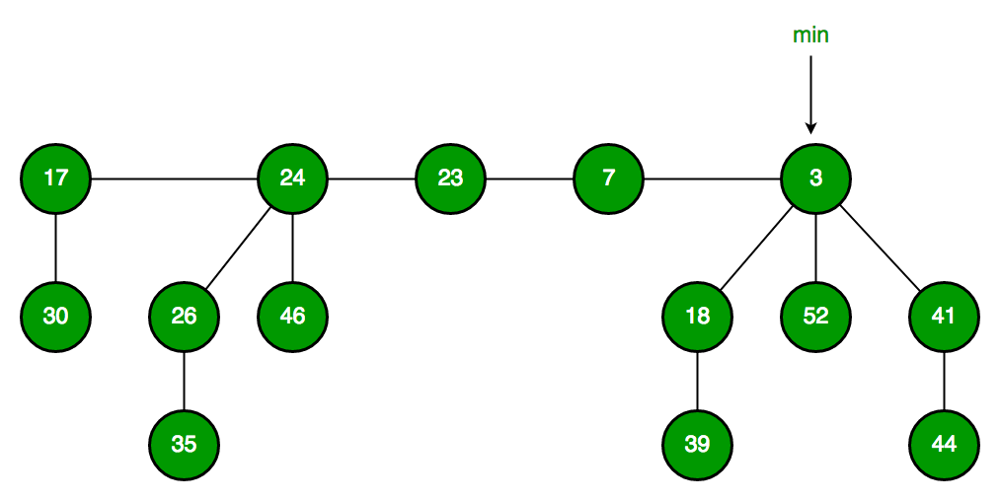

# Fibonacci Heap

## 前言

我们第一个例子就是cpp实现斐波那契数列。那么我们来看一下一个有趣的数据结构：*Fibonacci Heap*。

这个数据结构的特性：

|     行为     | 时间复杂度 |                          对比                           |
| :----------: | :--------: | :-----------------------------------------------------: |
|   Find Min   |    Θ(1)    |            Same as both Binary and Binomial             |
|  Delete Min  |  O(Log n)  |          Θ(Log n) in both Binary and Binomial           |
|    Insert    |    Θ(1)    |         Θ(Log n) in Binary and Θ(1) in Binomial         |
| Decrease-Key |    Θ(1)    |          Θ(Log n) in both Binary and Binomial           |
|    Merge     |    Θ(1)    | Θ(m Log n) or Θ(m+n) in Binary and Θ(Log n) in Binomial |

这个树本身长相并没有任何与斐波那契数列相像之处，但是在计算时间复杂度的时候使用了斐波那契数列的方式渐进分析所以命名位斐波那契堆

## 推荐阅读

- [Fibonacci Heap](https://www.cs.princeton.edu/~wayne/teaching/fibonacci-heap.pdf)
